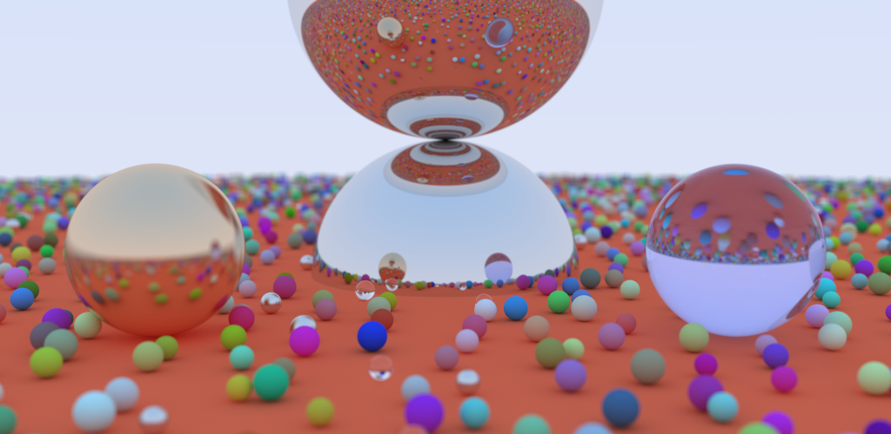
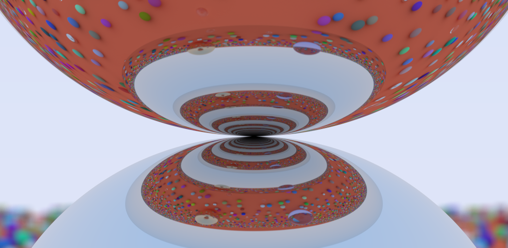

# Ray tracing engine

A small ray traycing engine in C++

For now, only spheres are renderable. They may have multiple materials :
- Lambertian, the classic diffuse and opaque color
- Metalic, with more or less fuziness.
- Dielectic like glass.

In order reduce rendering time, I use a bounding volume hierachy. It highly
reduce the number of ray collision check during the rendering.
